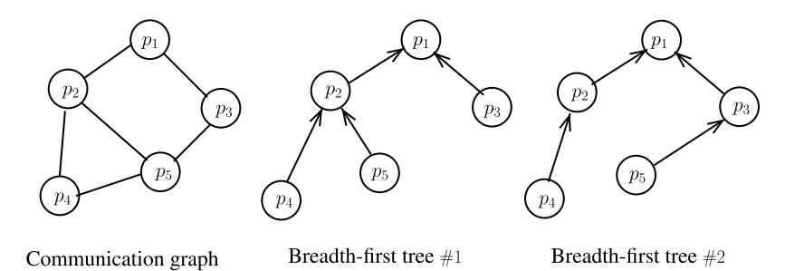
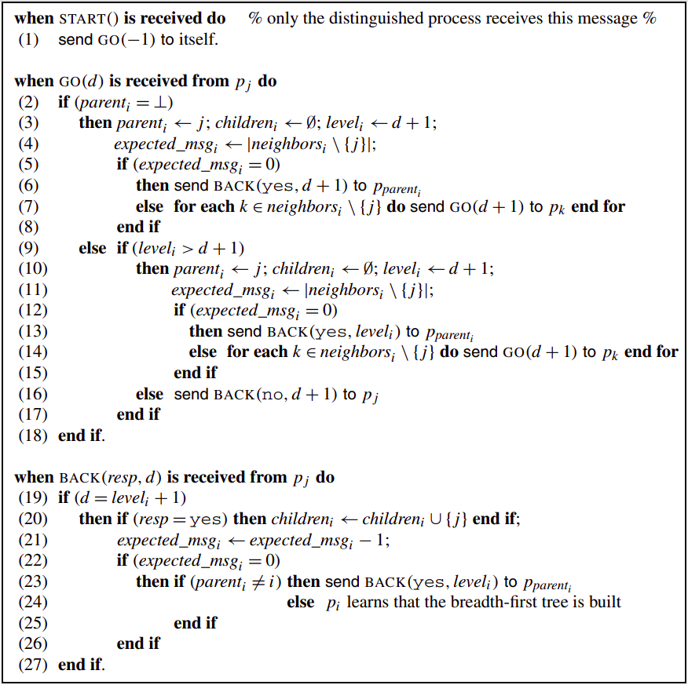
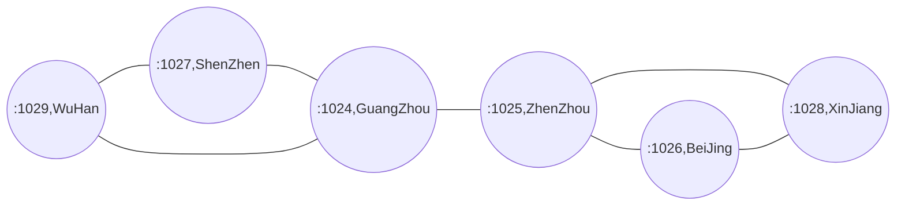

## Breadth-First Spanning Tree
Let us remember that the distance between a process **p<sub>i</sub>** and a process **p<sub>j</sub>** is the length of the *shortest path* connecting these two processes, where the length of a path is measured by the number of channels it is made up of (this distance is also called the hop distance)  
  
The spanning tree built by the algorithm([S1-broadcast-and-convergecase](../S1-broadcast-and-convergecast/)) does not necessarily build a breadth-first tree, because the tree that is built depends on the speed of messages during the execution of the algorithm, and consequently distinct trees can be built
by different executions.  
  
Breadth-first traversal does not imply that the tree that is built is independent of the execution. It only means that two processes at distance **d** of the root in the communication graph are at distance **d** in the tree, as follow:  
  
    
According to the structure of the graph, two processes at distance **d** of the root do not necessarily have the same parent in different executions. A simple example where process **p<sub>5</sub>**, which is at distance 2 of the root **p<sub>1</sub>**, has different parents in the breadth-first. This section presents an algorithm that build breadth-first trees.
  
### Principle of the Algorithm   
This algorithm, which is due to **T.-Y. Cheung (1983)**, is based on parallel traversals of the communication graph. These traversals are concurrent and some of them can stop others. In addition to the local variables **parent<sub>i</sub>**, **children<sub>i</sub>**, and **expexted_msg<sub>i</sub>**, each process **p<sub>i</sub>** manages a local variable, denoted **level<sub>i</sub>**, which represents its current approximation of its distance to the root. Moreover, each message **GO()** carries now the current level of the sending process. Then, when a process **p<sub>i</sub>** receives a message **GO(d)**, there are two cases according to the current state of **p<sub>i</sub>** and the value of **d**.  

* The message **GO(d)** is the first message **GO()** received by **p<sub>i</sub>**. In that case, **p<sub>i</sub>** initializes **level<sub>i</sub>** to **d + 1** and forwards the message **GO(d + 1)** to its neighbors(except the sender of the message **GO(d)**).  
  
* The message **GO(d)** is not the first message **GO()** received by **p<sub>i</sub>** and **level<sub>i</sub>** > **d + 1**. In that case, **p<sub>i</sub>***(a)* updates its variable **level<sub>i</sub>** to **d + 1**, *(b)* defines the sender of the message GO(d) just received as its new parent, and *(c)* forwards a message **GO(d +1)** to each of its other neighbors **p<sub>k</sub>** in order that they recompute their distances to the root.  
  


* The *broadcast* problem is a one-to-many communication problem. It consists in designing an algorithm that allows the distinguished process **p<sub>a</sub>** to disseminate information to the whole set of processes.  
  
* The *convergecast* problem is a many-to-one communication problem. It consists in designing an algorithm that allows each process **p<sub>j</sub>** to send information **v<sub>j</sub>** to a distinguished process **p<sub>a</sub>** for it to compute some function **f()**, which is on a vector **[v1,...,vn]** containing one value per process.  
  
*Broadcast* and *convergecast* can be seen as dual communication operations. They are usually used as a pair: **p<sub>a</sub>** broadcasts a query to obtain values, one from each process, from which it computes the resulting value **f()**.  
  
As a simple example that we will implement: 
**p<sub>a</sub>** is a process that queries sensors for temperature values, and final out all the values.  
  
#### Algorithm  
  
  
#### Description of the Algorithm
The algorithm is described above, Initially, a single process **p<sub>i</sub>** receives an external message **START()**. This process, which will be the root of the tree, sends a message **GO(−1)** to itself(line 1). When it receives the message, **p<sub>i</sub>** sets **parent<sub>i</sub>** = **i** (hence it is the root) and its distance to itself is set to **level<sub>i</sub>** = 0. As previously indicated, there are two cases when a process **p<sub>i</sub>** receives a message **GO(d)**. Let us remember that **d** represents the current approximation of the distance of the sender of the message **GO()** to the root. If **parent<sub>i</sub>** = ⊥, this message is the first message **GO()** received by **p<sub>i</sub>**(line 2). In that case, **p<sub>i</sub>** enters the tree at
level **d + 1**(line 3) and propagates the network traversal to its other neighbors by sending them the message **GO(d + 1)** in order that they enter the tree or improve their position in the tree under construction (line 5). If the sender of the message **GO(d)** is its only neighbor, **p<sub>i</sub>** sends by return the message **BACK(yes,d + 1)** to inform it that it is one of its children at level **d + 1**(line 6).  
If the message **GO(d)** is not the first message **GO()** received by **p<sub>i</sub>**, there are two cases. Let **p<sub>j</sub>** be the sender of the message **GO(d)**.  
* If **level<sub>i</sub>** ≤ d +1, **p<sub>i</sub>** cannot improve its position in the tree. It then sends by return the message **BACK(no,d + 1)** to inform the sender of the message **GO()** that it cannot be its child at distance d + 1 of the tree(line 16). Hence, **p<sub>i</sub>** stops the network traversal associated with the message **GO(d)** it has received.  
  
* If **level<sub>i</sub>** > d + 1, **p<sub>i</sub>** has to improve its position in the tree under construction. To that end, it propagates the network traversal associated with the message **GO(d)** it has received in order to allow its other neighbors to improve their positions in the tree. Hence, it executes the same statements as those executed when it received its first message **GO(d)**(lines 10–15 are exactly the same as lines 3–8). When a process **p<sub>i</sub>** receives a message **BACK(resp,d)**, it considers it only if **level<sub>i</sub>** = d-1(line 19). This is because this message is meaningful only if its sender **p<sub>j</sub>** sent it when its level was **level<sub>j</sub>** = d = **level<sub>i</sub>** + 1. In the other cases, the message **BACK()** is discarded. If the message is meaningful and **resp = yes**, **p<sub>i</sub>** adds **p<sub>j</sub>** to its children(and those are at level **level<sub>i</sub>** + 1, line 20).  
Finally, as in *a simple parallel network traversal*, if it has received a message **BACK(−,level<sub>i</sub> + 1)** from each of its other neighbors, **p<sub>i</sub>** sends a message **BACK(yes,level<sub>i</sub>)** to its current parent. If **p<sub>i</sub>** is the root, it learns that the breadthfirst tree is built. Let us observe that, if **p<sub>i</sub>** is not the root, it is possible that it later receives other messages **GO()** that will improve the current value of **level<sub>i</sub>**.  
  
### Implementation 
For example:   

```bash  
#ZhenZhou[localhost:1025] is launched right now...
#GuangZhou[localhost:1024] is launched right now...
#ShenZhen[localhost:1027] is launched right now...
#WuHan[localhost:1029] is launched right now...
#BeiJing[localhost:1026] is launched right now...
#XinJiang[localhost:1028] is launched right now...
#-------------------------------
#The Tree root: ZhenZhou(localhost:1025)
#The Vertex[GuangZhou:localhost:1024]'s children: ShenZhen(localhost:1027) WuHan(localhost:1029) 
#The Vertex[ZhenZhou:localhost:1025]'s children: XinJiang(localhost:1028) BeiJing(localhost:1026) GuangZhou(localhost:1024) 
-------------------------------
$ ./Tree ZhenZhou
```  
### Advance  
Once the Tree was builded, We can add a type of message, **ASK()**, to use the tree. For example we can use the tree to broadcase and convergecast in a determined path. So how to implement ?
