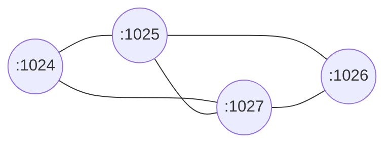

## An Introductory Example: Learning the Communication Graph  
  
As a simple example, this section presents an asynchronous algorithm that allows each process to learn the communication graph in which it evolves. It is assumed that the channels are bidirectional and that the communication graph is connected (there is a path from any process to any other process).  
  
### Initial Knowledge  
Each process **p<sub>i</sub>** has identity **id<sub>i</sub>**, and no process knows **N** (the total number of processes). Initially, a process **p<sub>i</sub>** knows its identity and the identity **id<sub>j</sub>** of each of its neighbors. Hence, each process **p<sub>i</sub>** is initially provided with a set neighborsi and, for each **id<sub>j</sub>** ∈ **neighbors<sub>i</sub>**, the pair <**id<sub>i</sub>**, **id<sub>j</sub>**>  denotes locally the channel connecting **p<sub>i</sub>** to **p<sub>j</sub>** . Let us observe that, as the channels are bidirectional, both <**id<sub>i</sub>**, **id<sub>j</sub>**>  and <**id<sub>j</sub>**, **id<sub>i</sub>**> denote the same channel and are consequently considered as synonyms.  

### The Forward/Discard Principle  
The principle on which the algorithm relies is pretty simple: Each process initially sends its position in the graph to each of its neighbors. This position is represented by the pair <**id<sub>i</sub>**, **neighbors<sub>i</sub>**>. Then, when a process **p<sub>i</sub>** receives a pair <**id<sub>k</sub>**, **neighbors<sub>k</sub>**> for the first time, it updates its local representation of the communication graph and forwards the message it has received to all its neighbors (except the one that sends this message). This is the “when new, forward” principle. On the contrary, if it is not the first time that **p<sub>i</sub>** receives the pair <**id<sub>k</sub>**, **neighbors<sub>k</sub>**>, it discards it. This is the “when not new, discard” principle.  

### Pseudocode
  
  
### Implementation  
For example:  

---

```shell
# deploy the vertexes shown in the above figure, meanwhile start learning...
$ ./deploy
```

### Advance
I implemented the algorithm in a static way, now I got a new idea:  
A new vertex just coming to want to join the colony(集群)，it must send a learning request to the colony(集群) and then make everybody learn again to know the new vertex.  
So, how to implement the new demand?